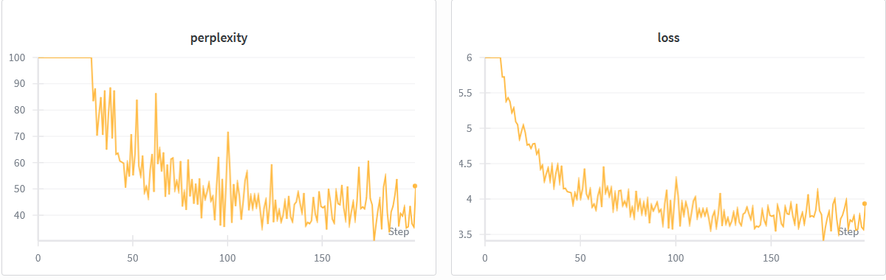

# 问答栏

用于写简短问题回答。

## BPE

### Understanding Unicode 

- What Unicode character does chr(0) return?

> \x00，空字符

- How does this character’s string representation (__repr__()) differ from its printed representa-tion?

> repr 会返回 '\x00'，print 调用 __str__ 直接输出空白

- What happens when this character occurs in text?

> python cli 中，直接 debug 输出调用 __repr__，print 调用 __str__，会体现区别。

### Unicode Encodings

- What are some reasons to prefer training our tokenizer on UTF-8 encoded bytes, rather than
UTF-16 or UTF-32?

> 别的编码表示单个字符太长了

- Consider the following (incorrect) function

> 大部分字符由多 bytes 编码，比如 "牛"，错误编码会异常。

- Give a two byte sequence that does not decode to any Unicode character(s).

> 0xFF

### BPE impl

- BPE Training on TinyStories

> 十个进程一起跑的，大致总时长 2min 以内，瓶颈在读入和预分词处理上，性能分析也能看出来。
> 内存峰值大致 11GB（6GB + 5GB swap），期间有将 count 转化为 generator 优化内存。
> 词元上，可以看到类似 Tony, horizon 等单次都能学习到。

-  BPE Training on OpenWebText

> 本地机子没实力跑。

### tokenizer impl

- Implementing the tokenizer

> 其实最后一个测试 XFAIL 是刻意不让通过的，直接加载全部文件还是太吃了。
> 一些踩坑：
> regex.split 不会保留配对 pattern，正则匹配时要用 () 包裹匹配获得匹配组，这样就能保留了。
> 对 special_token 排序是必要的，一个测试测出了这个错误：<|endoftext|><|endoftext|>
> 应该没了，采用的每次循环替换，比较低能，不过单个单次很短，应该没什么问题了，没有必要改链表。

- Experiments with tokenizers

> 这里统一采用 TinyStory 的 10k 词汇表，WebText 的练不起QED
> compare for TinyStory-cut: 12976 and 3118, rate 0.24028976572133168
> compare for owt-cut: 10147 and 3046, rate 0.30018724746230413

## Transformer

### Resource accounting

参数信息：

    vocab_size : 50,257
    context_length : 1,024
    num_layers : 48
    d_model : 1,600
    num_heads : 25
    d_ff : 6,400

- tainable parameters

大致粗略的分析：

|       主块        | 内部块    | 参数大小         | Matrix Flops                             |
| :---------------: | --------- | ---------------- | ---------------------------------------- |
|     Embedding     | Embedding | vocab $\times$ d | 0     
| RoPE      |RoPE |2 d (sin+cos)    | 2 $\times$ seq |
| Transformer Block | RMSNorm   | 0                | 0    $\times$ d                        
|                   | Attention | 4 $d^2$          | 12 $\times$ seq $\times$ $d^2$           |
|                   | SwiGLU    | 3 $d \times d_f$ | 6 $\times$ seq $\times d \times d_f$     |
|      Linear       | Linear    | d $\times$ vocab | 2 $\times$ seq $\times$ d $\times$ vocab |


在给定数据下：

大致参数量 $8507622400$ ，运算量 $4694687744000$

总空间大致为 8113 MB, 7.92GB。

浮点运算 4.69e12，即 4.69 TFLOPs。

Attention 和 SwiGLU 吃的比较多。

## Training

- Tuning the learning rate

    - $lr=1$: loss 均匀减小，但收敛很慢。
    - $lr=10$: loss 减小很快。
    - $lr=100$: loss 几乎收敛，没有遇到发散的问题，可能测试比较简单。

- Memory and FLOPS

设 $P$ 是模型占用，$N$ 是层数，内存量大致为：

$$P=12ND^2+(V+L)D$$

因此，参数需要 $4P$ 存储参数，$4P$ 存储梯度，$8P$ 存储优化器（两个动量元），同时，激活内存大致为：

$$4(NBHL^2+10NBNBLD)$$

峰值内存要将这些全部加起来。

前向传播的 FLOPs 为：

1. Embedding: $2BLDV$
2. Transformer: $8BLD^2+4BL^2D+5BHL^2$
3. swiglu: $8BLD^2$

总和大致为：

$$N\times (24BLD^2+4BL^2D+5BHL^2) + 2BLDV + 5BLV$$

反向传播需要 $2F$ 的FLOPS。

优化器需要 $10P$ 的 FLOPS。

|                  | 占用                                                 |
| ---------------- | ---------------------------------------------------- |
| 内存             | $$4(NBHL^2+10NBNBLD)$$                               |
| 参数量           | $P=12ND^2+(V+L)D$                                    |
| 前向传播FLOPs    | $$F=N\times (24BLD^2+4BL^2D+5BHL^2) + 2BLDV + 5BLV$$ |
| 反向传播加优化器 | $$2F+10P$$                                           |

在 GPT-2 XL 中，内存占用 $24.9+8.18B$ GB，单次正向加反向加优化，FLOPs 为 $1.036\times 10^{13}B$ 。

在 A100 上，设 $B=1024$，训练 $40$ 万步，大约需要 $4651$ 天，$12.7$ 年。

## Experiment

按照文档的配置，配了一个 0.017 B 的模型，使用完整 tinyStory 数据集，训练如下：

这里没有记录 val loss，实测和 train loss 相当。



一个生成如下：
```pain
Input: Once upon a time, there was a little boy, he fell in love with a little girl,
------
 there was a new cat named Lily.
The next day, Tim and Lily was so much. They played together in the little boy. He had a little girl who lived in the big, they went to find her room. He knew it and found a little girl.
"Can I'm a long time. He did not a small cat. She wanted to help the little boy and they found a big tree. They were scared.
One day, a boy named Tom. He said, "Yes, "I'm sorry, you can you help me."
"Yes, Mom!" The other kids and said, "You can you, I love you, and went back to go away!"
-----Got end token, generating ended!-----
```